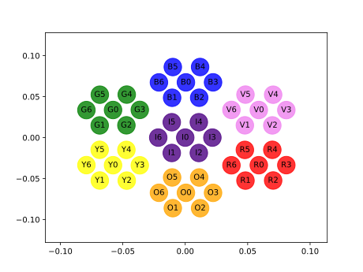

Instrument configuration
========================

The Stripeline code often needs to use numerical parameters that characterize
the instrument. These numbers are usually retrieved by means of simulations or
actual measurements, and they are kept in the Stripeline repository as `YAML
<https://en.wikipedia.org/wiki/YAML>`_ files. Since YAML files are text files,
they can be read and modified with any text editor. In this section we describe
the format of the files used by Stripeline, as well as a few examples of their
usage. To load YAML files in Python, you can use the `PyYAML
<http://pyyaml.org/wiki/PyYAML>`_ library. Section :ref:`parameter-files`
provides an overview of the way parameter files are used in the STRIP pipeline.

All the files described in this section are available in the directory
`instrument`.

.. note::

    All the parameters in the STRIP instrument database have the measure unit
    specified at the end of the name itself. For style consistency, every
    character uses lowercase, e.g., ``fknee_hz``.

Polarimeters
------------

The file `strip_detectors.yaml
<https://github.com/lspestrip/stripeline/tree/master/instrument/strip_detectors.yaml>`_
contains the parameters that quantify the noise properties of each STRIP
polarimeter. It has one key, ``polarimeters``, which is a list of dictionaries.
Each dictionary refers to one polarimeter. The order *is not significant*, as
the association between polarimeters and horns is defined in the focal plane
database (see :ref:`focal-plane-db`). The key ``polarimeters`` has the following
items:

=============== ======= ==============================================
Name            Type    Meaning
=============== ======= ==============================================
``id``          int     Unique index of the polarimeter
``det_q1``      dict    Noise characteristics of detector Q1's output
``det_q2``      dict    Noise characteristics of detector Q2's output
``det_u1``      dict    Noise characteristics of detector U1's output
``det_u2``      dict    Noise characteristics of detector U2's output
=============== ======= ==============================================

The noise characteristics of each detector are the following:

=============== ======= ==============================================
Name            Type    Meaning
=============== ======= ==============================================
``fknee_hz``    float   Knee frequency, in Hz
``alpha``       float   Slope of the 1/f noise component
``wn_sigma_k``  float   RMS of the white noise component, in Kelvin
=============== ======= ==============================================

There should be at least 49 entries in this file, as this is the number of
polarimeters to be used in STRIP. Spare polarimeters can be defined here as
well.

.. _focal-plane-db:

Focal plane
-----------

The file `strip_focal_plane.yaml
<https://github.com/lspestrip/stripeline/tree/master/instrument/strip_focal_plane.yaml>`_
contains the geometry of the focal plane, i.e., the orientation of the 49 horns.
Each orientation is a 3D vector of length one which points toward the point on
the sky sphere where the centre of the main beam is located. The boresight
direction coincides with horn I0, and it is conventionally set to be `(0, 0, 1)`
(the z axis).

Here are a reduced version of the file, containing only two horns:

.. code-block:: yaml

    ---
    horns:
        I0:
            id: 0
            module_id: 0
            polarimeter_id: "0"
            color: indigo
            fwhm_x_deg: 0.347
            fwhm_y_deg: 0.344
            ellipticity: 1.008,
            directivity_dbi: 54.76
            xpd_db: 44.53
            sub_spillover: 0.013964
            main_spillover: 0.016704
            orientation:
            - 4.720000e-06
            - -0.000000e+00
            - 1.000000e+00

        I1:
            id: 1
            module_id: 1
            polarimeter_id: 1
            color: "indigo"
            fwhm_x_deg: 0.347
            fwhm_y_deg: 0.345
            ellipticity: 1.006,
            directivity_dbi: 54.75
            xpd_db: 43.93
            sub_spillover: 0.013704
            main_spillover: 0.017151
            orientation:
            - -1.077670e-02
            - -1.876756e-02
            - 9.997658e-01
    ...

Each entry within ``horns`` contains the following items:

======================== ======= =====================================================
Name                     Type    Meaning
======================== ======= =====================================================
``id``                   int     Unique index of the horn (0-48)
``module_id``            int     Index of the horn within the module (0-6)
``polarimeter_id``       int     Index of the polarimeter attached to the horn
``color``                str     Color of the module to whom the horn belongs
``fwhm_x_deg``           float   Full Width Half Maximum of the beam (degrees) along X
``fwhm_y_deg``           float   Full Width Half Maximum of the beam (degrees) along Y
``ellipticity``          float   Ellipticity of the beam
``directivity_dbi``      float   Directivity of the beam (dBi)
``xpd_db``               float   Cross-polar discrimination factor of the beam (dB)
``sub_spillover``        float   Fraction of spillover from the secondary mirror
``main_spillover``       float   Fraction of spillover from the primary mirror
``orientation``          tuple   3D vector of length one
======================== ======= =====================================================

The PyYAML module loads YAML files into dictionaries. So, in order to access the
``color`` field of the horn ``I0``, you can write::

    with open('instrument/strip_focal_plane.yaml', 'rt') as f:
        d = yaml.load(f)
        print(d['horns']['I0']['color'])  # prints "indigo"

The following plot shows the orientation in the UV plane of the 49 horns, where
U and V are the X and Y components of the orientations:

The plot has been created using the following script:

.. literalinclude:: strip_focal_plane_plot.py

Associations between symmetric horns
************************************

It is possible to specify that some characteristics of a horn are to be mutuated
from its symmetric pair. This is the purpose of the ``pairs`` section, which
specifies the pairs of symmetric horns in the focal plane. Here is a short
example:

..  code-block:: yaml

    ---
    pairs:
        V1: R5
        V2: R4
    ...

With these associations, each time a parameter (e.g., ``ellipticity``) for beam
V1 is not found in the database, the corresponding parameter for beam R5 is used
instead.

.. _scanning-strategy:

Scanning strategy
-----------------

The details of the scanning strategy are stored in the YAML file
`scanning_strategy.yaml
<https://github.com/lspestrip/stripeline/tree/master/instrument/scanning_strategy.yaml>`_.
See the section :ref:`scanning-the-sky` for more information about how to use
this file to produce timelines.
